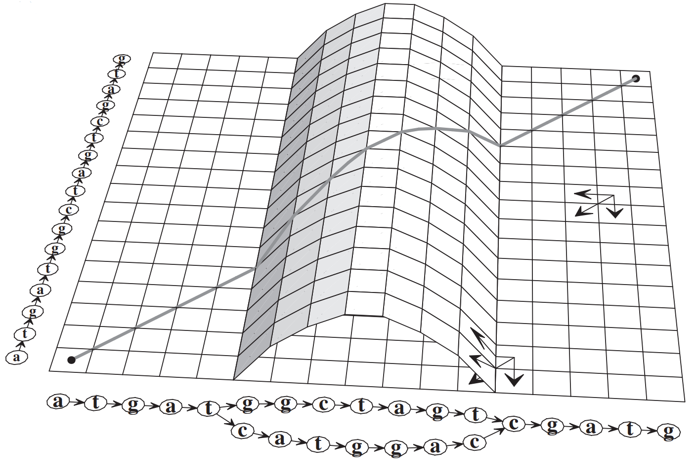

# 偏序比对（Partial Order Alignment implementation, POA）的简单构造
## 问题陈述与分析
定义一个斯坦纳问题（[斯坦纳树](https://oi-wiki.org/graph/steiner-tree/)），给定 $n$ 条序列 $s_i$ $(1\leq i\leq n)$，找到一条新的序列 $q$，使得 $\sum_i d(s_i, q)$ 最小。其中 $d(s_i, q)$ 表示序列 $s_i$ 和 $q$ 之间的编辑距离。

这就是生物学中经典的多序列比对（Multiple Sequence Alignment, MSA）问题。从得到的MSA中，可以推断出生物序列的同源性，并可以进行系统发育分析，以评估序列的共同进化起源。

回顾双序列比对的动态规划算法：给定序列 $s_i$ 和 $s_j$，其中子序列 $s_{i,1}\ldots s_{i,x}$ 和 $s_{j,1}\ldots s_{j,y}$ 的比对，可以通过增、删、改分别从 $s_{i,1}\ldots s_{i,x}$ 和 $s_{j,1}\ldots s_{j,y-1}$ 的比对、 $s_{i,1} \ldots s_{i,x-1}$ 和 $s_{j,1}\ldots s_{j,y}$ 的比对、 $s_{i,1} \ldots s_{i,x-1}$ 和 $s_{j,1}\ldots s_{j,y-1}$ 的比对中进行状态转移。因此，可以从中选择最优的状态转移方案，确定最终的比对方案。

    
     
    <em>二维空间上的状态转移</em>

那么如果是三条序列进行比对，应该是个三维空间的状态转移。而拓展到 $n$ 条序列，就会是 $n$ 维空间的状态。由于状态空间庞大且复杂，MSA 问题实际是一个 NP 完全问题。

## 偏序比对

现有的[解决方案](https://en.wikipedia.org/wiki/Multiple_sequence_alignment)多采用启发式方法。而倘若 MSA 能够变成两个有序形态进行比对，那么就可以仿照初始的二维空间的状态转移方案。因此，基于隐马尔可夫模型（Hidden Markov Model，HMM）的方法通过将 MSA 表示为一种称为偏序图（partial-order graph）的有向无环图（directed acyclic graph, DAG）形式来工作。图上的有向边代表字符的先后顺序。

    
     
    <em>偏序比对</em>

如上图所示，这种方法相当于对状态空间进行了合并压缩。因为 DAG 是有序的，因此可以通过对 DAG 图上一状态的遍历，确定当前的最佳比对。要确定图中 DAG 图上入度为 2 的点 c 和序列第 3 个位置上的 g 点的最佳对齐方案，就可以通过对 DAG 图上点 t 和点 c（点 c 的两个前驱）与序列第 2 个位置上的 t 点分别的对齐状态（共 6 种）转移而来。